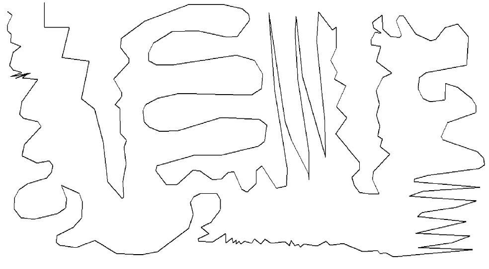

# Simplification.NET
C# wrapper for [Rust library](https://github.com/urschrei/rdp/tree/master) by [urschrei](https://github.com/urschrei) for [Ramer-Douglas-Peucker](https://en.wikipedia.org/wiki/Ramer%E2%80%93Douglas%E2%80%93Peucker_algorithm) and [Visvalingam-Whyatt](https://en.wikipedia.org/wiki/Visvalingam%E2%80%93Whyatt_algorithm) algorithms.

## Usage

```
using Simplification.Algorithms;

double[][] input = [
    [0.0, 0.0],
    [5.0, 4.0],
    [11.0, 5.5],
    [17.3, 3.2],
    [27.8, 0.1],
];

ISimplificationAlgorithm rdpAlgorithm = new RdpAlgorithm();

// For RDP, Try an epsilon of 1.0 to start with. Other sensible values include 0.01, 0.001
double[][] simplified = rdpAlgorithm.Simplify(input, 1.0); // returns simplified data
UIntPtr[] simplifiedIndices = rdpAlgorithm.SimplifyIdx(input, 1.0); // returns simplified indices

ISimplificationAlgorithm visvAlgorithm = new VisvalingamWhyattAlgorithm();

simplified = visvAlgorithm.Simplify(input, 1.0); // returns simplified data
simplifiedIndices = visvAlgorithm.SimplifyIdx(input, 1.0); // returns simplified indices

simplified = ((VisvalingamWhyattAlgorithm)visvAlgorithm)
    .PreserveTopologySimplify(input, 1.0); // returns simplified data, while preserving topology
	
simplified = ((VisvalingamWhyattAlgorithm)visvAlgorithm)
    .SimplifyMemOptimized(input, 1.0); // returns simplified data but uses less memory
```

## Warning
Even though Visvalingam.Simplify and Visvalingam.SimplifyMemOptimized use the same algorithm output is different, maybe I will fix this in the future. But both methods get thing done properly, SimplifyMemOpt is more aggresive.

## Benchmarks

### Platform
```

BenchmarkDotNet v0.13.12, Windows 10 (10.0.19045.4529/22H2/2022Update)
12th Gen Intel Core i7-12700, 1 CPU, 20 logical and 12 physical cores
.NET SDK 8.0.300
  [Host]     : .NET 8.0.5 (8.0.524.21615), X64 RyuJIT AVX2
  DefaultJob : .NET 8.0.5 (8.0.524.21615), X64 RyuJIT AVX2


```

### Ramer-Douglas Peucker algorithm
| Method                              | Mean        | Error      | StdDev     | Median      | Gen0    | Gen1    | Gen2    | Allocated  |
|------------------------------------ |------------:|-----------:|-----------:|------------:|--------:|--------:|--------:|-----------:|
| SimplifyRdp_vals_500_toler_0_1      |   106.16 μs |   6.205 μs |  18.295 μs |   113.56 μs |  3.7842 |       - |       - |   48.54 KB |
| SimplifyRdp_vals_500_toler_0_5      |    94.41 μs |   3.782 μs |  11.152 μs |    98.04 μs |  3.4180 |       - |       - |   44.18 KB |
| SimplifyRdp_vals_500_toler_0_9      |    31.30 μs |   0.617 μs |   0.547 μs |    31.30 μs |  2.9297 |       - |       - |   37.71 KB |
| SimplifyRdp_vals_1000_toler_0_1     |   239.14 μs |  11.894 μs |  35.070 μs |   255.49 μs |  7.5684 |  0.2441 |       - |   98.32 KB |
| SimplifyRdp_vals_1500_toler_0_1     |   361.03 μs |  22.244 μs |  65.588 μs |   391.00 μs | 11.4746 |  0.7324 |       - |  146.98 KB |
| SimplifyRdpIdx_vals_500_toler_0_1   |    96.52 μs |   5.950 μs |  17.545 μs |   104.72 μs |  2.9297 |       - |       - |   37.45 KB |
| SimplifyRdpIdx_vals_500_toler_0_5   |    83.16 μs |   5.058 μs |  14.914 μs |    88.48 μs |  2.8687 |       - |       - |   36.73 KB |
| SimplifyRdpIdx_vals_500_toler_0_9   |    32.21 μs |   0.352 μs |   0.329 μs |    32.16 μs |  2.7466 |       - |       - |   35.65 KB |
| SimplifyRdpIdx_vals_1000_toler_0_1  |    98.14 μs |   3.687 μs |  10.871 μs |   101.13 μs |  2.9297 |       - |       - |   37.45 KB |
| SimplifyRdpIdx_vals_1500_toler_0_1  |    97.62 μs |   4.421 μs |  13.036 μs |   101.07 μs |  2.9297 |       - |       - |   37.45 KB |
| SimplifyRdp_vals_12000_toler_0_1    | 2,924.44 μs | 232.488 μs | 685.497 μs | 3,066.83 μs | 89.8438 | 27.3438 | 27.3438 | 1115.11 KB |
| SimplifyRdpIdx_vals_12000_toler_0_1 | 2,876.09 μs | 140.119 μs | 413.143 μs | 2,997.48 μs | 74.2188 | 29.2969 | 29.2969 |  889.06 KB |


### Visvalingam-Whyatt algorithm
| Method                             | Mean          | Error       | StdDev      | Median        | Gen0     | Gen1     | Gen2    | Allocated  |
|----------------------------------- |--------------:|------------:|------------:|--------------:|---------:|---------:|--------:|-----------:|
| SimplifyVw_vals_500_toler_0_5      |     66.139 μs |   6.6480 μs |  19.6018 μs |     48.873 μs |   3.4180 |        - |       - |   44.18 KB |
| SimplifyVw_vals_500_toler_1_5      |     56.721 μs |   0.8290 μs |   0.7349 μs |     56.861 μs |   3.1128 |        - |       - |   40.38 KB |
| SimplifyVw_vals_500_toler_3        |    104.847 μs |   5.0088 μs |  14.7685 μs |    111.347 μs |   2.9297 |        - |       - |   37.62 KB |
| SimplifyVw_vals_1000_toler_0_5     |    178.975 μs |  12.2477 μs |  36.1126 μs |    196.876 μs |   6.7139 |   0.1221 |       - |   86.13 KB |
| SimplifyVw_vals_1500_toler_0_5     |    293.125 μs |  12.3395 μs |  36.3833 μs |    306.644 μs |  10.0098 |   0.4883 |       - |   130.8 KB |
| SimplifyVwIdx_vals_500_toler_0_5   |     75.208 μs |   2.7263 μs |   8.0384 μs |     77.788 μs |   2.8687 |        - |       - |   36.73 KB |
| SimplifyVwIdx_vals_500_toler_1_5   |     93.081 μs |   3.3618 μs |   9.9122 μs |     96.659 μs |   2.8076 |        - |       - |   36.09 KB |
| SimplifyVwIdx_vals_500_toler_3     |    101.466 μs |   4.1660 μs |  12.2836 μs |    105.068 μs |   2.7466 |        - |       - |   35.63 KB |
| SimplifyVwIdx_vals_1000_toler_0_5  |    139.699 μs |  13.4006 μs |  39.5119 μs |    143.750 μs |   5.6152 |   0.1221 |       - |   73.02 KB |
| SimplifyVwIdx_vals_1500_toler_0_5  |    154.101 μs |   2.8969 μs |   2.8451 μs |    153.841 μs |   8.5449 |   0.2441 |       - |  109.76 KB |
| SimplifyPT_vals_500_toler_0_5      |    640.235 μs |   8.5795 μs |   7.6055 μs |    639.373 μs |   2.9297 |        - |       - |   42.21 KB |
| SimplifyPT_vals_500_toler_1_5      |    749.852 μs |   6.4272 μs |   6.0120 μs |    749.961 μs |   2.9297 |        - |       - |   39.07 KB |
| SimplifyPT_vals_500_toler_3        |    811.441 μs |   7.3295 μs |   6.8561 μs |    809.506 μs |   2.9297 |        - |       - |   37.43 KB |
| SimplifyPT_vals_1000_toler_0_5     |  1,514.120 μs |   7.7500 μs |   7.2494 μs |  1,512.980 μs |   5.8594 |        - |       - |   84.73 KB |
| SimplifyPT_vals_1500_toler_0_5     |  1,799.576 μs |  14.5928 μs |  13.6501 μs |  1,798.862 μs |   9.7656 |        - |       - |  128.98 KB |
| SimplifyOpt_vals_500_toler_0_5     |      8.923 μs |   0.1051 μs |   0.0932 μs |      8.896 μs |   0.3052 |        - |       - |    3.96 KB |
| SimplifyOpt_vals_500_toler_1_5     |     15.387 μs |   0.0635 μs |   0.0530 μs |     15.392 μs |   0.3052 |        - |       - |    3.96 KB |
| SimplifyOpt_vals_500_toler_3       |     16.740 μs |   0.3060 μs |   0.2862 μs |     16.630 μs |   0.3052 |        - |       - |    3.96 KB |
| SimplifyOpt_vals_1000_toler_0_5    |     26.365 μs |   0.3936 μs |   0.3489 μs |     26.364 μs |   0.6104 |        - |       - |    7.87 KB |
| SimplifyOpt_vals_1500_toler_0_5    |     53.622 μs |   0.8641 μs |   0.7660 μs |     53.608 μs |   0.9155 |        - |       - |   11.77 KB |
| SimplifyVw_vals_12000_toler_0_5    |  2,083.612 μs |  41.0960 μs |  47.3263 μs |  2,086.235 μs |  85.9375 |  27.3438 | 27.3438 | 1015.87 KB |
| SimplifyVwIdx_vals_12000_toler_0_5 |  1,982.066 μs |  37.0464 μs |  34.6532 μs |  1,984.961 μs |  62.5000 |  27.3438 | 27.3438 |  872.52 KB |
| SimplifyVwPT_vals_12000_toler_0_5  | 20,077.673 μs | 293.1432 μs | 259.8638 μs | 20,038.420 μs |  62.5000 |        - |       - | 1004.39 KB |
| SimplifyVwOpt_vals_12000_toler_0_5 |  4,059.296 μs |  78.3011 μs |  80.4094 μs |  4,053.321 μs | 140.6250 | 140.6250 | 23.4375 |   93.83 KB |

## Simplified line
### Before simplification


### After simplification
RDP 5 tolerance


Visvalingam 10 tolerance


Visvalingam preserve topology 10 tolerance


Visvalingam memory optimized 10 tolerance


## Package
https://www.nuget.org/packages/Simplification/1.0.2
